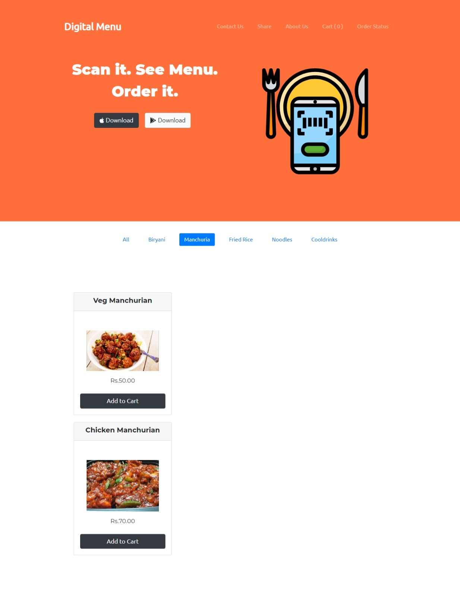
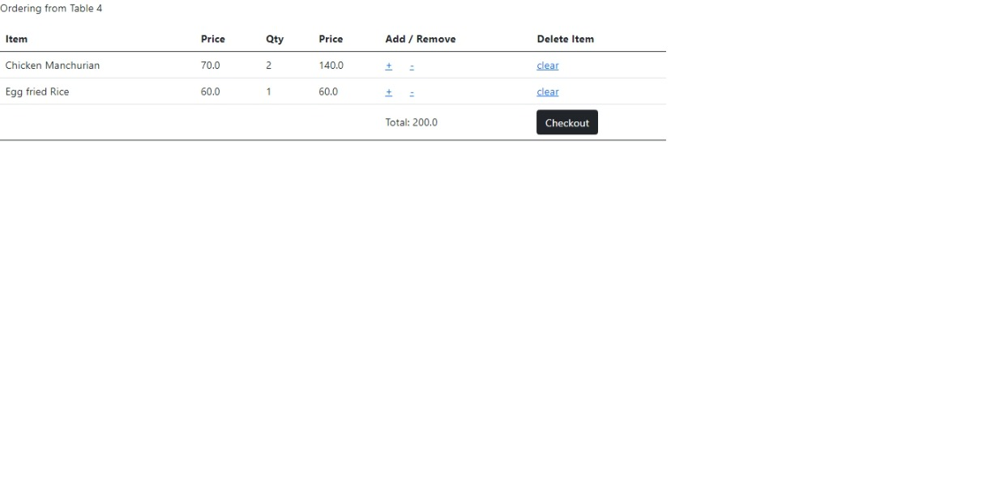
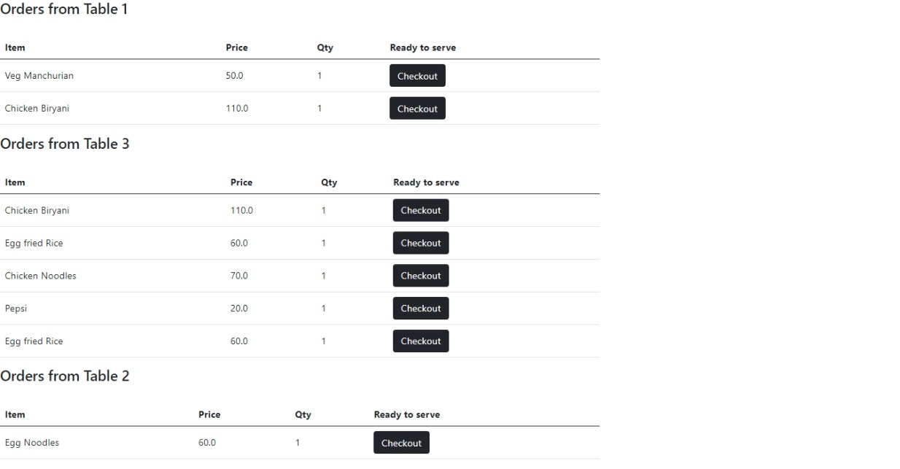

# Digital-Menu-Card

## Environment

```sh
$  pip install -r requirements.txt
```


## Run


```python
python manage.py makemigrations
python manage.py migrate
python manage.py runserver
```


## UI

### Customer View





### Manager View


